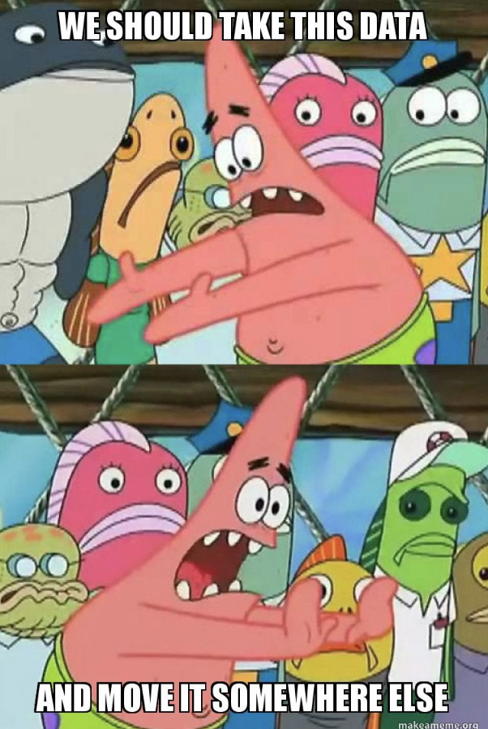

# Journal - 2025-09-13 - Example Day

## Today in one sentence
- I learned that Git can be a simple way to save my progress, not just a scary developer tool.

## What I learned
- A repository is just a project folder that Git tracks.
- A commit is like a saved checkpoint with a message.
- Markdown lets me write clean notes without using complicated software.

## Terms I am still learning
- **repository** - a folder for a project and its history
- **commit** - one saved change with a short message
- **data lake** - a place where raw data can be stored before cleaning or analysis

## What confused me
- I still mix up Git and GitHub sometimes.
- I am not yet fully sure when to commit.

## One small next step
- [ ] Create one more practice commit after class

## Git checkpoint
- [x] I created or updated a file
- [x] I wrote a commit
- [ ] I pushed my changes

## Evidence from today (optional)
- Bootcamp notes on SQL basics
- https://dataengineering.ph/

## Reflection (optional)
- What felt easy today? Writing bullet points instead of long paragraphs.
- What felt difficult today? Remembering the Git commands in order.
- What do I want to understand better next time? The difference between local changes and what appears on GitHub.

## Mood or meme (optional)
- Today felt like "I am confused, but I am less confused than yesterday."
