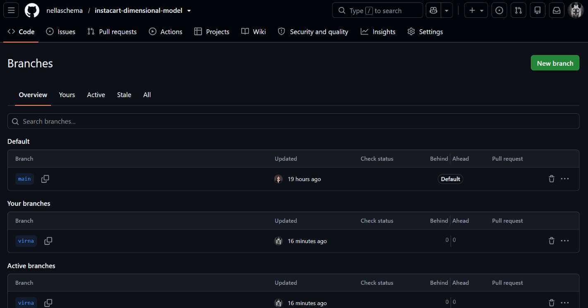
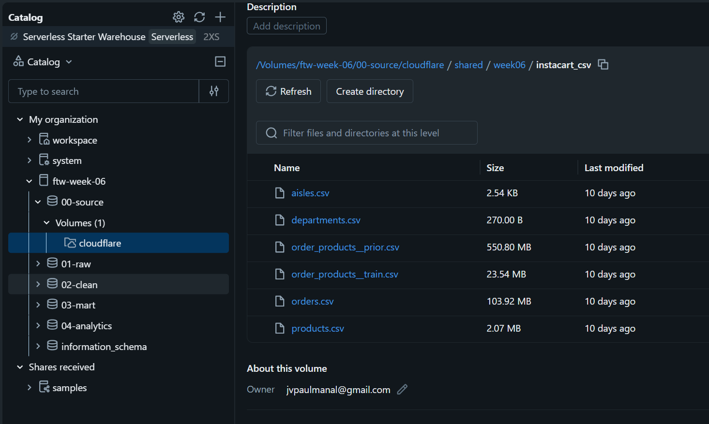
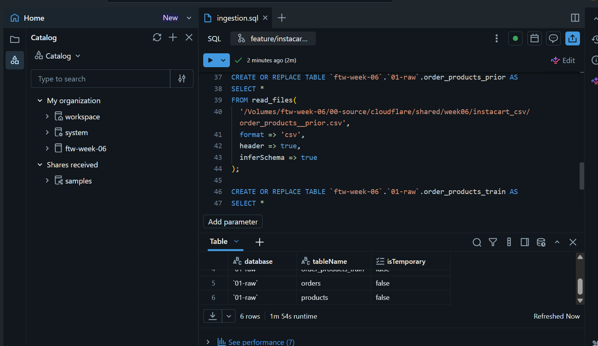
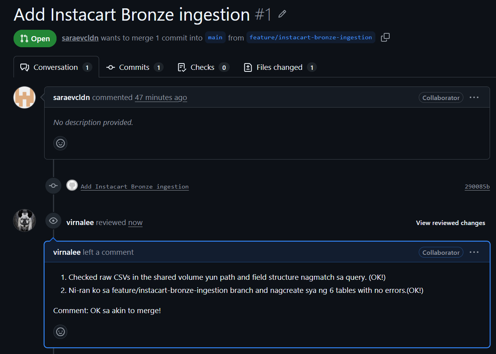

=============================================================================
# 📓 Journal - 2026-08-30 - Day 1: Git & Databricks Integration
=============================================================================

## 📝 A. Today in one sentence
1. Went from confused and scared to successfully cloning a teammate's repo, creating my own branch, and reviewing a groupmate's Pull Request--all in one day. Yay!

## 💡 B. What I learned
1. Can't push to a repo I don't own.
   - How: Used "Use this template" to make my own copy instead of cloning.
2. Can edit/commit files in-browser with github.dev.
   - How: Pressed the period key on the repo page.
3. Databricks "Git folder" ≠ GitHub repo: _repo lives on GitHub, each person clones it into their own Databricks Git folder_.
   - How: Watched a YouTube guide on Databricks + GitHub integration.
4. Teammates never push/pull directly into each other's Git folders: _everyone syncs through the shared GitHub repo_.
5. Teams can pair individual git folders with one shared "final pipeline" folder that only pulls from main.
6. Creating a branch in a Databricks Git folder creates it on GitHub too.
   - How: Saw my "virna" branch appear live on Nella's repo. 🥰
7. Fine-grained tokens scope access to specific repos/permissions, unlike broader classic tokens.
8. Reviewing a teammate's Pull Request can mean more than reading code... I can check the raw data and run the query myself before approving.
   - How: Sara sent a DM via Slack re: Bronze ingestion; I checked the source CSVs in the Catalog, switched my Databricks Git folder to her branch, ran her SQL, and confirmed all 6 tables were created successfully with no errors.

## 📚 C. Terms I am still learning
1. **Repository (repo)** - a folder online that holds a project's files and its full history of changes.
2. **Clone** - making a copy of a repo onto your own computer or workspace, so you can work on it.
3. **Fork** - making your own separate copy of someone else's repo under your own account, so you can experiment without affecting the original.
4. **Template** - a starter repo you copy to begin a brand new project, without carrying over the original's history.
5. **Branch** - a separate version of the project where you can make changes safely, without affecting the main version.
6. **Commit** - saving a snapshot of your changes with a short note describing what you did.
7. **Push** - sending your saved changes from your computer up to the shared repo online.
8. **Pull** - downloading the newest changes from the shared repo into your own copy.
9. **Merge** - combining someone's changes into the main version once they're approved.
10. **Pull Request (PR)** - asking the team "can you check my changes before we add them to the main version?"
11. **Git folder** - a copy of a GitHub repo that lives inside Databricks so you can work on it there.
12. **Fine-grained token** - a GitHub access key limited to only specific repos and permissions, for extra safety.

## 🤔 D. What confused me
1. Why I couldn't push to the original repo.
   - Clarified: only owner/collaborators can push. ([video](https://www.youtube.com/watch?v=fiDc6RgOhjU))
2. Mixed up cloning, forking, and templates.
   - Clarified: Sir Myk's README pointed to "Use this template"; confirmed via video since I'm a visual learner. ([video](https://www.youtube.com/watch?v=pGLwb5TJphM))
3. Being added to a workspace ≠ seeing a shared folder.
   - Clarified: asked an AI in simpler terms and watched videos last night; Sara also shared a helpful video. ([video](https://www.youtube.com/watch?v=uljYTx7nzy8))
   - Turns out the workspace only had a catalog so far.
4. Wasn't sure if I needed Nella's Git credential to collaborate.
   - Clarified using AI: everyone links their own GitHub account, _never someone else's_.
5. Wasn't sure how to keep a "final" pipeline version safe from edits.
   - Clarified: a Git folder can just stay on main and get pulled periodically.
6. Wasn't sure what Sara actually needed from me on her Pull Request.
   - Clarified: she wanted a review before merging, so I checked her raw CSV source and tested her query myself instead of just reading the code.

## 🎯 E. One small next step
- [ ] Start making my first actual changes/commits on my "virna" branch
- [ ] Research how to write better PR review comments
- [ ] Set up a proper images/screenshots folder in the repo (instead of guessing filenames lol)
- [ ] Start building my own beginner-friendly Git/GitHub dictionary--for non-tech, "old people like me" 😂

## ✅ F. Git checkpoint
- [x] Created my own copy of the repo using "Use this template"
- [x] Created journal/2026-08-30-day1.md
- [x] Joined the shared Databricks workspace
- [x] Linked my own GitHub account to Databricks
- [x] Mapped out the full team Git workflow
- [x] Cloned Nella's repo into my own Databricks Git folder
- [x] Created my own branch (virna), confirmed on GitHub
- [x] Reviewed and tested Sara's Pull Request (Bronze ingestion)
- [x] Committed and pushed today's journal entry
- [ ] Committed my first actual pipeline code on my "virna" branch
- [ ] Pushed my pipeline code to GitHub

## 🧭 G. Decisions or assumptions
1. Assuming each teammate will link their own GitHub account rather than sharing one credential.
2. Assuming Nella's repo stays the shared source of truth for the group's pipeline.

## 📸 H. Evidence from today
1. How I created my branch (Databricks → GitHub): Nella's repo → copied URL → Databricks: Create → Git folder → pasted URL → cloned → clicked "Branch: main" → Create Branch → named "virna" → Create → checked out on my branch → confirmed live on GitHub 🎉
2. Reviewed and tested Sara's Pull Request "Add Instacart Bronze ingestion" — ran her `ingestion.sql` on her branch, confirmed 6 tables created successfully.
3. Screenshots:
   
   
   
   
Note to self: My PR review comment felt a bit basic compared to how proper code reviews are usually written. I want to research good PR review practices and improve how I phrase feedback next time.

## 🪞 I. Reflection
1. What felt easy today: Once I saw the visual diagram of how everything connects, the concept finally clicked.
2. What felt difficult today: Finding the actual shared Databricks workspace, turns out it just had a catalog in it so far, not what I expected.
3. What I want to understand better next time: Actually writing and pushing real pipeline code, not just setup and reviewing.

## 💛 J. Pat on my own shoulder :3
=============================================================================
💛 Rebuilding trust in myself, one brave step at a time. 😅
=============================================================================