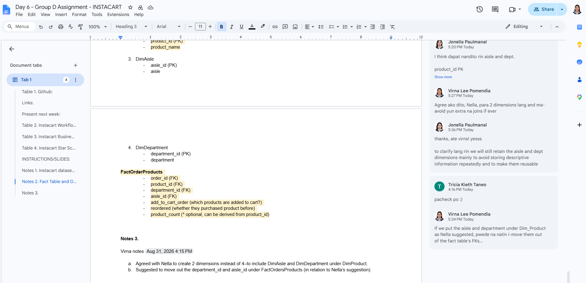
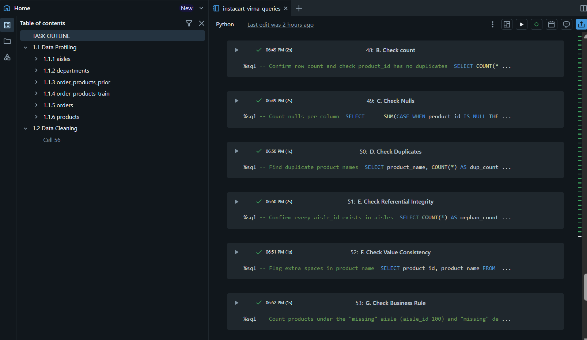
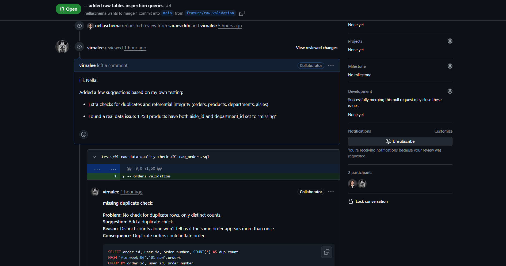

=============================================================================
# 📓 Journal - 2026-08-31 - Day 2: Kicking Off Query Development
=============================================================================

## 📝 A. Today in one sentence
- Reviewed a teammate's PR and left suggestions on checks we might be missing.

## 💡 B. What I learned
- How to leave inline review comments on a GitHub PR, including adding SQL code blocks with triple backticks.
- The difference between "Comment", "Approve", and "Request changes" when submitting a PR review.

## 📚 C. Terms I am still learning
- Code block: text wrapped in triple backticks (```) that renders as formatted, syntax-highlighted code in GitHub comments
- Referential integrity: a check that a foreign key value actually exists in the table it's supposed to reference
- Orphan row: a row whose foreign key doesn't match any row in the referenced table
- Review vs. Comment vs. Approve vs. Request changes: the options when submitting a GitHub PR review: "Comment" gives feedback without blocking, "Approve" signals okay-to-merge, "Request changes" blocks merging until addressed
- Pending comment: a review comment that's saved but not yet visible to others until the review is submitted

## 🤔 D. What confused me
- Thought Sara was missing an `order_products_test` table since `orders` has eval_set values for prior/train/test.
- Clarified: checked the raw table list, confirmed only 6 tables exist — test-order line items were never released in this dataset.

## 🎯 E. One small next step
- [x] Find the `instacart-test-queries` folder in the Shared Databricks workspace
- [x] Create my own notebook there
- [x] Wrote profiling queries in my test notebook covering all 6 Instacart raw tables
- [x] Reviewed Nella's PR #4 (raw tables inspection queries) — left 7 review comments with suggested queries
- [ ] Currently developing cleaning queries
- [ ] Identify keys (with Team D)
- [ ] Identify dimensions (with Team D)
- [ ] Design the dimension model (with Team D)
- [ ] Business questions (with Team D)
- [ ] Create a new branch in my Git folder (not on main)
- [ ] Add my finalized query to the correct file in the GitHub folder
- [ ] Create a Pull Request to main
- [ ] Wait for team review before merging
- [ ] Learn how to build the dimension model in the Databricks UI
- [ ] Carried over: Research how to write better PR review comments
- [ ] Carried over: Start building my own beginner-friendly Git/GitHub dictionary

## ✅ F. Git checkpoint
- [ ] I created or updated a file
- [ ] I wrote a commit (this is my first actual pipeline code on the "virna" branch)
- [ ] I pushed my changes to GitHub

## 🧭 G. Decisions or assumptions
1. Following Nella's workflow: test → finalize → branch → PR → main.
2. Everything done within Databricks, per Nella's instructions.

## 📸 H. Evidence from today

1. Commented on the team's shared doc (Notes 3. Fact Table and Dimensions): agreed with Nella on using 2 dimensions instead of 4, and suggested moving department_id/aisle_id out of Fact_OrderProducts' FKs since they'd live under Dim_Product instead
2. Created and ran profiling queries (schema, row count, nulls, duplicates, referential integrity, business rules) across all 6 raw Instacart tables in my own test notebook
3. Reviewed Nella's PR #4
4. Screenshots:

| Description | Screenshot |
|---|---|
| Comment on team's shared doc re: dimension model |  |
| Profiling queries run in our assigned test notebook |  |
| Review comments submitted on Nella's PR #4  |  |

## 🪞 I. Reflection
- What felt easy today: getting used to the interface a bit
- What felt difficult today: commenting on a teammate
- What I want to understand better next time: pushing to main and not just reviewing

## 💛 J. Pat on my own shoulder :3

=============================================================================

💛 Left some polite chaos in Nella's PR #4, hoping I didn't break anything 🤞 Calling it a win for today! Yay! 

=============================================================================