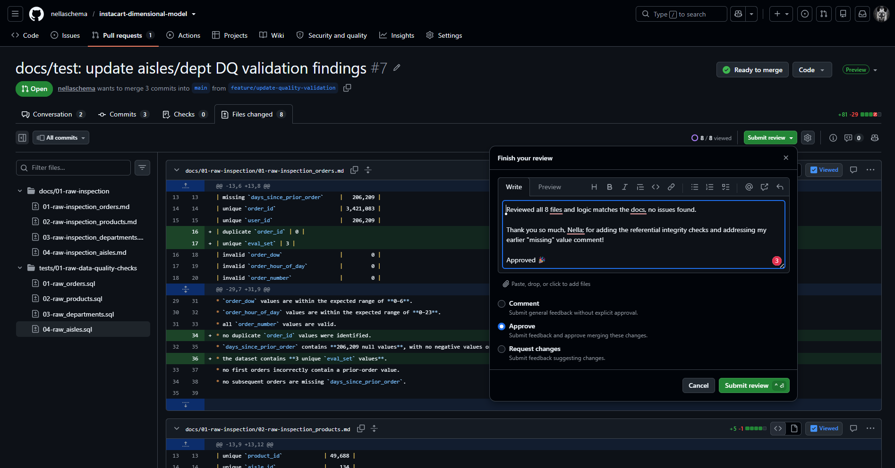
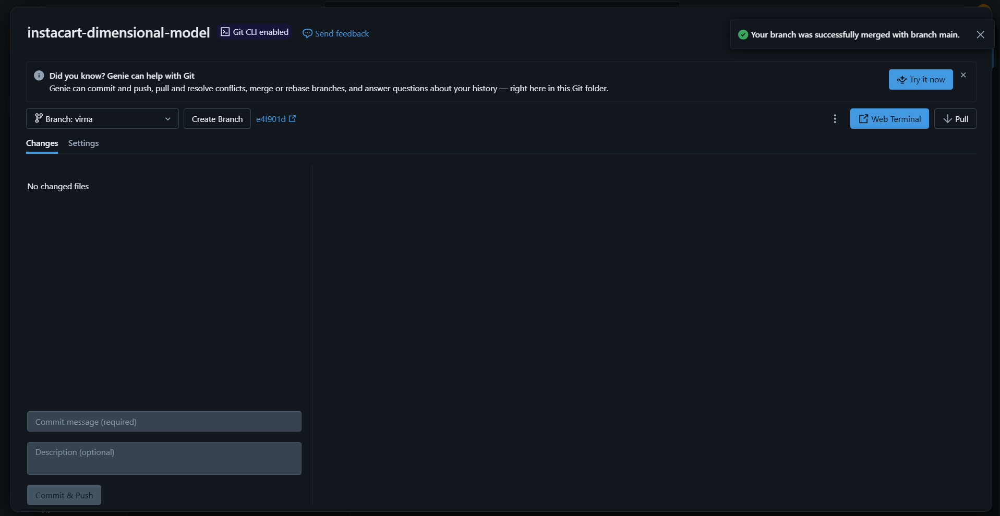
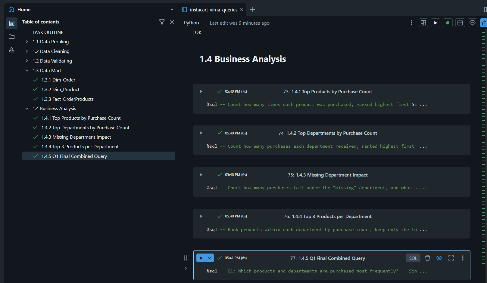
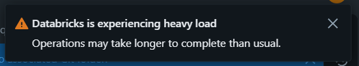

=============================================================================
# 📓 Journal - 2026-09-01 - Day 3: Building the Mart Tables and Q1 Business Analysis
=============================================================================

## 📝 A. Today in one sentence
- Built and tested the Mart tables and Q1 business analysis end to end, then caught and started fixing a data issue before syncing everything to my branch.

## 💡 B. What I learned
- How to sync my fork with the original repo on GitHub, and pull those updates into my Databricks Git folder.
- How to merge the latest main branch into my own branch (virna) to keep it up to date, without affecting main itself.
- Added validation files for the Mart layer (Dim_Order, Dim_Product, Fact_OrderProducts) comparing row counts, nulls, duplicates, and referential integrity against the cleaned source tables.
- Combined all of Q1's sub-questions (top products, top departments, missing-department impact, top 3 per department, eval_set breakdown) into a single query using UNION ALL, instead of keeping them as separate queries.
- Found that combining everything into one query without a LIMIT on the product breakdown produced 88,910 unreadable rows — fixed by adding LIMIT 20 inside the "Top Product" subquery.

## 📚 C. Terms I am still learning
1. **Viewed** - a checkbox on each file in a PR that marks it as reviewed by you; it's just for your own tracking, not required by GitHub to approve.
2. **Sync fork** - a GitHub button that updates your fork's branch with the latest commits from the original repo it was forked from.
3. **Merge branch** - pulls changes from another branch into your current branch, without changing the source branch.
4. **UNION ALL** - stacks results from multiple SELECT queries into one result set, as long as each SELECT has the same number and type of columns.

## 🤔 D. What confused me
- Wasn't sure if merging main into my branch would change anything on main itself — confirmed it only updates my branch (virna), main stays untouched.
- My combined Q1 query showed a NULL department for one row — traced it back to a single product (Scotch Kids 5" Scissors) whose aisle_id and department_id were both NULL in raw data, and realized my products_clean fix hadn't actually been re-run yet, so the NULL was still flowing through to Dim_Product.

## 🎯 E. One small next step
- [x] Chose Business Question 1 (products/departments purchased most) with Sara as partner
- [x] Added sub-questions and metric/dim/col needed for Q1 to the team's shared doc
- [x] Finalized the star schema: Dim_Order, Dim_Product, Fact_OrderProducts
- [x] Wrote and tested queries end to end (clean → mart → analysis) in my test notebook
- [x] Combined Q1's analysis into a single query answering all sub-questions plus eval_set breakdown
- [x] Created cleaning, mart, and business analysis .sql files in my branch (virna)
- [x] Added Mart validation files (row counts, nulls, duplicates, referential integrity vs. cleaned tables)
- [ ] Re-run products_clean in my notebook to confirm the missing-value fix actually applies
- [ ] Re-run Dim_Product, Fact_OrderProducts, and the Q1 query to confirm the NULL department is gone
- [ ] Copy the corrected files back into my branch
- [ ] Commit and push my .sql files so they show up on my branch in GitHub
- [ ] Create a Pull Request to main (not sure if I'll get to this today)
- [ ] Carried over: Start building my own beginner-friendly Git/GitHub dictionary

## ✅ F. Git checkpoint
- [x] I created or updated a file
- [ ] I wrote a commit
- [ ] I pushed my changes

## 🧭 G. Decisions or assumptions
- Chose Q1 with Sara (who's already ahead and largely done on her end) because it fits the star schema already built, and it lets us show a real data issue found while checking the data.
- Kept Dim_Order and Dim_Product as 2 dimensions instead of 4, folding aisle and department directly into Dim_Product.
- Decided not to filter eval_set out of Q1 — prior + train together give the fullest, most accurate purchase count. Confirmed with a volume check that prior makes up 95.91% of the data, train only 4.09%.

## 📸 H. Evidence from today
1. Reviewed and approved Nella's Pull Request #7 (docs/test: update aisles/dept DQ validation findings)
2. Learned that I need to pull the latest updates from main into my branch every time before running queries there, so my branch stays in sync with the team's latest work
3. Created and ran the cleaning, mart, and business analysis queries in our team's assigned test notebook
4. Tested the same queries in my virna branch (Databricks Git folder version of the files)
5. Ran into a "Databricks is experiencing heavy load" notice — definitely tested my patience lol
6. Screenshots:

| Description | Screenshot |
|---|---|
| Approved Nella's PR #7 |  |
| Pulled main into virna branch before running queries |  |
| Ran cleaning, mart, and Q1 queries in the test notebook |  |
| Ran the same queries in my virna branch files |  |
| "Databricks is experiencing heavy load" notice |  |

## 🪞 I. Reflection
- What felt easy today: Setting up the mart tables — the structure was already clear from yesterday's planning.
- What felt difficult today: Waiting through the "heavy load" slowdown.
- What I want to understand better next time: How to push my changes to GitHub properly, since I still haven't done that part.

## 💛 J. Pat on my own shoulder :3

=============================================================================

💛 Didn't get to push yet, but everything's clean and ready. That counts for something. 💛

=============================================================================

Note: This fb post caught my attention 😂 And honestly, it’s VERY relevant to what I’ve been doing today… well, almost. 😅

Credits to the original owner of this post. 🙌

