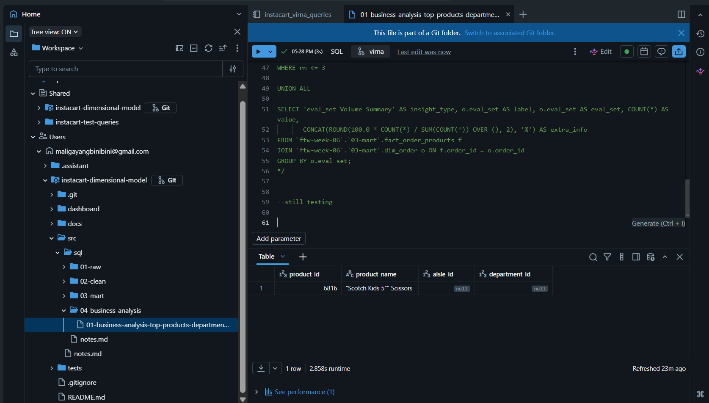
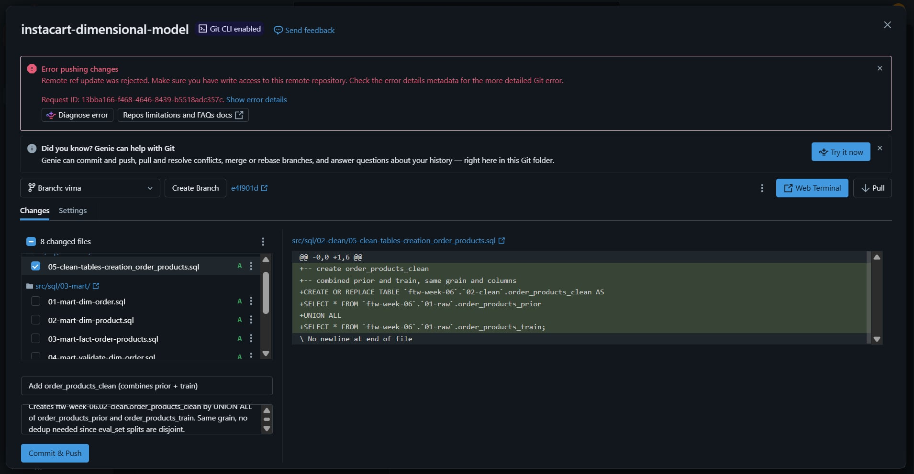
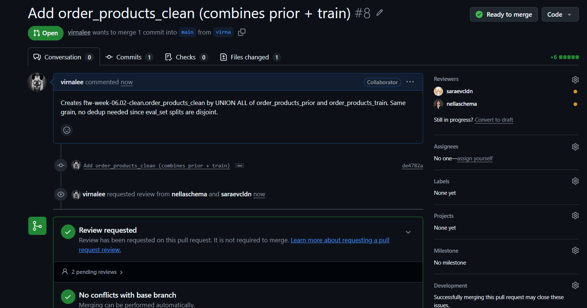
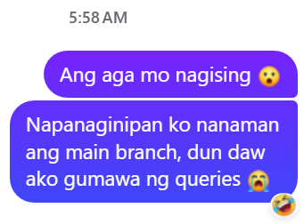
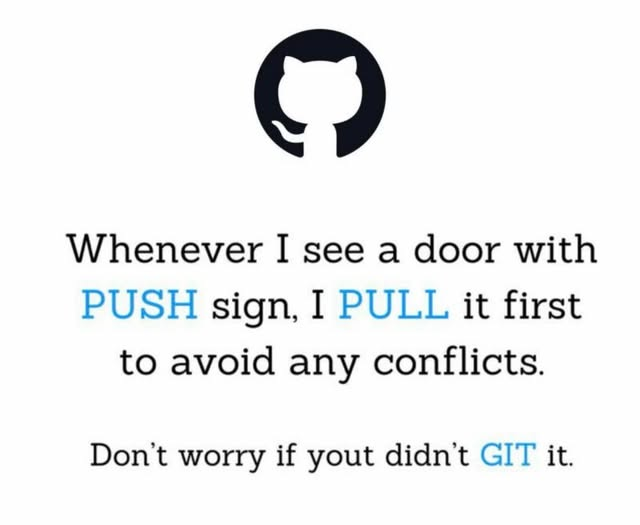

=============================================================================
# 📓 Journal - 2026-09-01 - Day 3: My First Commit, Push & PR--A Dream Come True 🥹
=============================================================================

## 📝 A. Today in one sentence
- Built and tested the Mart tables and Q1 business analysis end to end, fixed a data issue, and — after a genuine git detective saga — finally committed, pushed, and opened my first PR to Nella's repo.

## 💡 B. What I learned
- How to sync my fork with the original repo on GitHub, and pull those updates into my Databricks Git folder.
- How to merge the latest main branch into my own branch (virna) to keep it up to date, without affecting main itself.
- Added validation files for the Mart layer (Dim_Order, Dim_Product, Fact_OrderProducts) comparing row counts, nulls, duplicates, and referential integrity against the cleaned source tables.
- Combined all of Q1's sub-questions (top products, top departments, missing-department impact, top 3 per department, eval_set breakdown) into a single query using UNION ALL, instead of keeping them as separate queries.
- Why a push can get rejected even with correct write access — GitHub's GH007 error blocks a push if the commit's author email is a private email on your account. It's a privacy protection, not a permissions problem.
- Two different ways to fix a GH007 rejection: (1) set `git config user.email` to your GitHub no-reply address so it applies to that repo's commits, or (2) just turn off "Block command line pushes that expose my email" in GitHub → Settings → Emails (EASIER). Went with option 2 for speed.
- Staging in Databricks Git folders is per-file: only checked files get committed, so I can commit `05-clean-tables-creation_order_products.sql` on its own while the other 7 changed mart/validation files stay untouched for later, separate commits.
- Opening a PR: GitHub auto-fills the title/description from my commit message, and I can assign multiple reviewers (added both Sara and Nella) before creating it.

## 📚 C. Terms I am still learning
1. **Viewed** - a checkbox on each file in a PR that marks it as reviewed by you; it's just for your own tracking, not required by GitHub to approve.
2. **Sync fork** - a GitHub button that updates your fork's branch with the latest commits from the original repo it was forked from.
3. **Merge branch** - pulls changes from another branch into your current branch, without changing the source branch.
4. **UNION ALL** - stacks results from multiple SELECT queries into one result set, as long as each SELECT has the same number and type of columns.
5. **GH007** - GitHub's error code for a push rejected because the commit author's email is set to private on the pusher's account.
6. **No-reply email** - the `@users.noreply.github.com` address GitHub generates per account so you can commit/push without exposing your real email.

## 🤔 D. What confused me
- My combined Q1 query showed a NULL department for one row, traced it back to a single product (Scotch Kids 5" Scissors) whose aisle_id and department_id were both NULL in raw data, and realized my products_clean fix hadn't actually been re-run yet, so the NULL was still flowing through to Dim_Product.
- My first "Error pushing changes" message just said "make sure you have write access" which for me is misleading, since access wasn't actually the problem. Had to check "Show error details" to find the real GH007 reason buried in the git trace log.

## 🎯 E. One small next step
- [x] Chose Business Question 1 (products/departments purchased most) with Sara as partner
- [x] Added sub-questions and metric/dim/col needed for Q1 to the team's shared doc
- [x] Finalized the star schema: Dim_Order, Dim_Product, Fact_OrderProducts
- [x] Wrote and tested queries end to end (clean → mart → analysis) in my test notebook
- [x] Combined Q1's analysis into a single query answering all sub-questions plus eval_set breakdown
- [x] Created cleaning, mart, and business analysis .sql files in my branch (virna)
- [x] Added Mart validation files (row counts, nulls, duplicates, referential integrity vs. cleaned tables)
- [x] Re-run products_clean in my notebook to confirm the missing-value fix actually applies
- [x] Re-run Dim_Product, Fact_OrderProducts, and the Q1 query to confirm the NULL department is gone
- [x] Copy the corrected files back into my branch
- [x] Commit and push my .sql files so they show up on my branch in GitHub
- [x] Create a Pull Request to main
- [ ] Carried over: Start building my own beginner-friendly Git/GitHub dictionary
- [ ] Together with Team D and my partner Sara, commit and push the remaining mart/validation/business-analysis files as their own scoped commits

## ✅ F. Git checkpoint
- [x] I created or updated a file
- [x] I wrote a commit
- [x] I pushed my changes
- [x] I opened a Pull Request

## 🧭 G. Decisions or assumptions
- Chose Q1 with Sara (who's already ahead and largely done on her end) because it fits the star schema already built, and it lets us show a real data issue found while checking the data.
- Kept Dim_Order and Dim_Product as 2 dimensions instead of 4, folding aisle and department directly into Dim_Product.
- Decided not to filter eval_set out of Q1 — prior + train together give the fullest, most accurate purchase count. Confirmed with a volume check that prior makes up 95.91% of the data, train only 4.09%.
- Chose to disable "Block command line pushes that expose my email" rather than reconfigure git locally, since it was the faster fix and my profile email stays private either way.

## 📸 H. Evidence from today
1. Reviewed and approved Nella's Pull Request #7 (docs/test: update aisles/dept DQ validation findings)
2. Learned that I need to pull the latest updates from main into my branch every time before running queries there, so my branch stays in sync with the team's latest work
3. Created and ran the cleaning, mart, and business analysis queries in our team's assigned test notebook
4. Tested the same queries in my virna branch (Databricks Git folder version of the files)
5. Ran into a "Databricks is experiencing heavy load" notice - definitely tested my patience lol
6. Hit a GH007 push rejection, dug through the error details, and traced it to GitHub's email privacy protection
7. Opened my first Pull Request to `instacart-dimensional-model`, reviewers: Sara + Nella
8. Screenshots:

| Description | Screenshot |
|---|---|
| Approved Nella's PR #7 |  |
| Pulled main into virna branch before running queries |  |
| Ran cleaning, mart, and Q1 queries in the test notebook |  |
| Ran the same queries in my virna branch files |  |
| "Databricks is experiencing heavy load" notice |  |
| GH007 push rejection - error details |  |
| The fix!!! <3> |  |
| First successful commit + push + Opened PR |  |

## 🪞 I. Reflection
- What felt easy today: Setting up the mart tables — the structure was already clear from yesterday's planning.
- What felt difficult today: The GH007 push rejection took way longer to untangle than expected — bounced between Web Terminal, Databricks settings, and GitHub settings before landing on the actual fix.
- What I want to understand better next time: The difference between git auth (write access) vs. commit author identity — today made it click that a "rejected push" error isn't always about permissions.
- Honestly?? Seeing "Create pull request" turn green after all that was such a dream come true moment. First real PR, feels official now 🥹

## 💛 J. Pat on my own shoulder :3

=============================================================================

💛 This was my message to Sara earlier this morning. Definitely a dream coming true. :3 💛

=============================================================================

Note: This fb post caught my attention 😂 And honestly, it's VERY relevant to what I've been doing today… well, almost. 😅

Credits to the original owner of this post. 🙌

