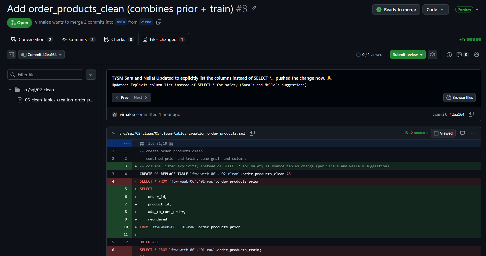
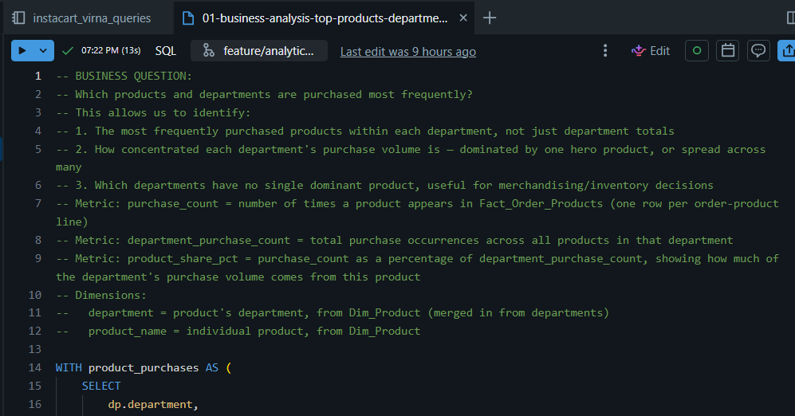
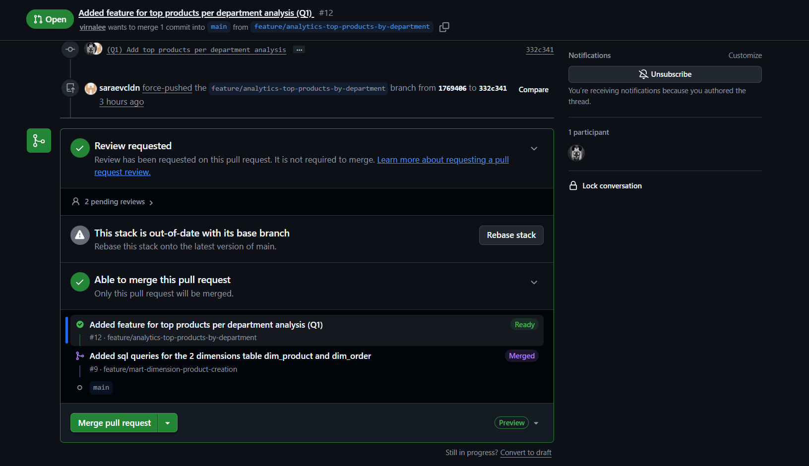
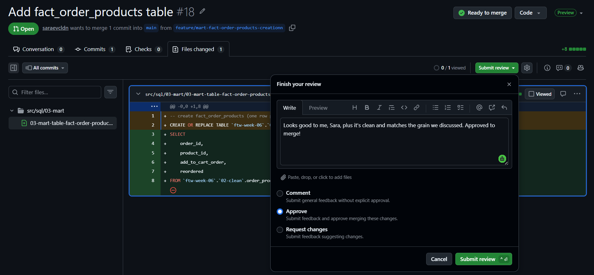

=============================================================================
# 📓 Journal - 2026-09-02 - Day 4: Testing Business Question 1 Queries Through Dashboard
=============================================================================

## 📝 A. Today in one sentence
- Built and pushed my Q1 query as a stacked PR, learned how force pushes and rebasing work along the way, and helped review a teammate's PR too.

## 💡 B. What I learned
- Replaced SELECT * with explicit columns in order_products_clean, per Sara's suggestion
- Practiced full Git flow: edit → run → check branch → pull → commit → push
- Pushing to an existing branch auto-updates its linked PR
- Built a Q1 query: top 3 products per department, plus each product's % share of department purchases
- Branched off a teammate's unmerged feature branch since my work depends on tables only there
- Learned about stacked PRs — a PR that depends on another still-open PR
- A PR's base can auto-switch once the branch it depended on gets merged — happened to PR #12: base was feature/mart-dimension-product-creation, then auto-changed to main once PR #9 merged
- Force push rewrites a branch's remote commit history, replacing old commits instead of adding on top — happened when Sara force-pushed my branch, replacing commit 1769406 with 332c341; compared both commits myself and confirmed the file content was unchanged
- Reviewed Sara's PR #18 (fact_order_products table) and approved it
- Learned about "rebasing a stack" — updates a stacked PR's branch to sit on the latest main; did this myself when GitHub flagged PR #12 as out-of-date, which also triggered my own force push (332c341 → d5448d2)
- Learned to double check *which* PR a teammate's comment belongs to — Sara's approval was on PR #18, not PR #12, so PR #12 is still waiting on her review
- Gained the courage to reply to Ms. Vanie, our SI, when she checked in on our assignment progress and asked about last week's Chinook Project presentation

## 📚 C. Terms I am still learning
1. **Git pull**: grabbing teammates' latest changes before adding your own
2. **Merge conflict**: when two people's edits to the same lines clash
3. **Pending review**: a review requested but not yet formally submitted
4. **Stacked pull request**: a PR targeting another still-open PR's branch instead of main
5. **Force push**: rewrites remote branch history instead of adding new commits on top; risky if others already pulled the old version
6. **Rebase (stack)**: updates a branch to sit on top of the latest base branch; can trigger a force push as a side effect

## 🤔 D. What confused me
- Today's PR (targeting a feature branch) vs. yesterday's (targeting main)
- Whether Sara's force push changed my query — it didn't, confirmed by comparing commits myself
- Thought Sara had already approved PR #12 because of her comment, but that approval was actually on a different PR (#18)

## 🎯 E. One small next step
- [x] Updated order_products_clean.sql to use explicit columns instead of SELECT *
- [x] Pulled latest changes before committing
- [x] Committed and pushed the update to branch virna, updating PR #8
- [x] Built and finalized the top-products-per-department query for Q1
- [x] Created a new branch off feature/mart-dimension-product-creation
- [x] Committed and pushed the new query file
- [x] Opened PR #12, stacked with #9, added Sara and Nella as reviewers
- [x] Ran the Q1 query, confirmed correct output (64 rows)
- [x] With Team D, committed and pushed remaining mart files and business-question features
- [x] Reviewed and approved Sara's PR #18
- [x] Rebased PR #12's stack once flagged as out-of-date with main
- [x] Replied to Ms. Vanie (our SI) on our assignment progress and the Chinook Project presentation
- [ ] Carried over: Start building my own beginner-friendly Git/GitHub dictionary
- [ ] Validate mart and Q1 query results (row counts, nulls, duplicates)
- [ ] Wait for Nella's review on PR #12
- [ ] Per Sara's suggestion: create an analytics table for the Q1 query (similar to what we did for Chinook), then use that table for the dashboard. TYSM Sara!!!!!

## ✅ F. Git checkpoint
- [x] Build and push the Q1 top-products-per-department query
- [x] Team D: commit and push remaining mart + business-question feature files
- [x] Test the Q1 analysis query output (ran successfully, 64 rows)
- [ ] Validate row counts / results against expectations
- [ ] Connect the query results to a dashboard
- [ ] Finalize dashboard visuals

## 🧭 G. Decisions or assumptions
- Chose to compare both commits myself to confirm Sara's force push didn't change my query, rather than assume it was fine
- Chose to rebase PR #12's stack once GitHub flagged it as out-of-date, rather than leave it as is

## 📸 H. Evidence from today
1. Applied the changes requested by Sara and Nella (explicit column list instead of SELECT *) on PR #8 and pushed it
2. Built and pushed top-products-per-department query
3. PR #12 base auto-changed to main after PR #9 merged, compared commits myself, confirmed force push left query unchanged, ran the Q1 query successfully (64 rows, correct output), and rebased PR #12's stack to resolve the "out-of-date" warning
4. Reviewed and approved Sara's PR #18
5. Screenshots:

| Description | Screenshot |
|---|---|
| Applied Sara & Nella's feedback on PR #8 and pushed |  |
| Built and pushed top-products-per-department query |  |
| PR #12: base change, force push check, Q1 run, rebase |  |
| Reviewed and approved PR #18 |  |

## 🪞 I. Reflection
- What felt easy today: The collab!!! Working with the team on reviews, force pushes, and stacked PRs felt smooth
- What felt difficult today: Waiting for Databricks lol
- What I want to familiarize and be an expert on next time: Navigating stacked PRs and rebasing on both Databricks and GitHub, especially predicting when GitHub will flag something as out-of-date

## 💛 J. Pat on my own shoulder :3

=============================================================================

💛 Great teamwork today! Yay! May naaambag na ako.😭 The collab made all our work so much lighter. Dashboard's up next tomorrow! 💪 💛

=============================================================================
