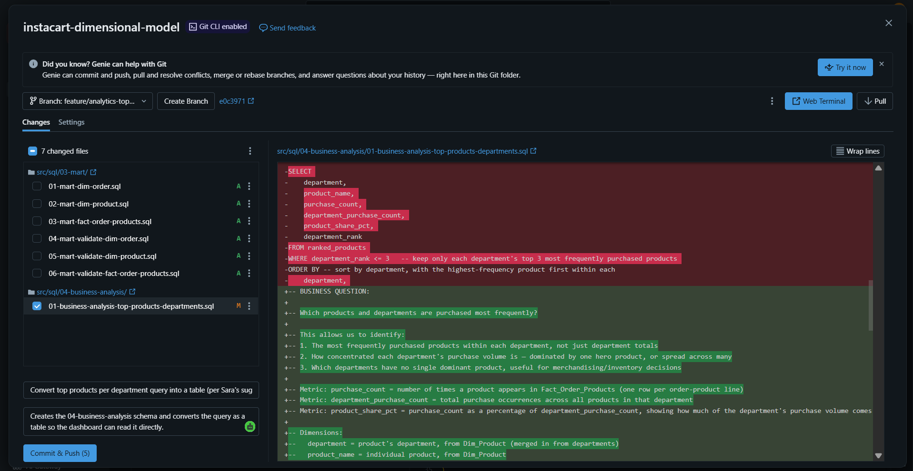
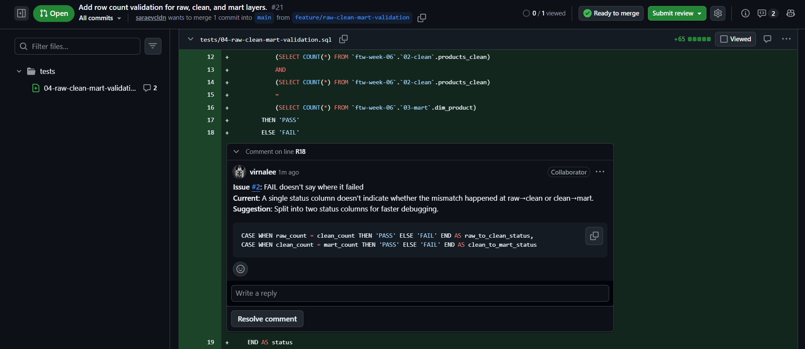
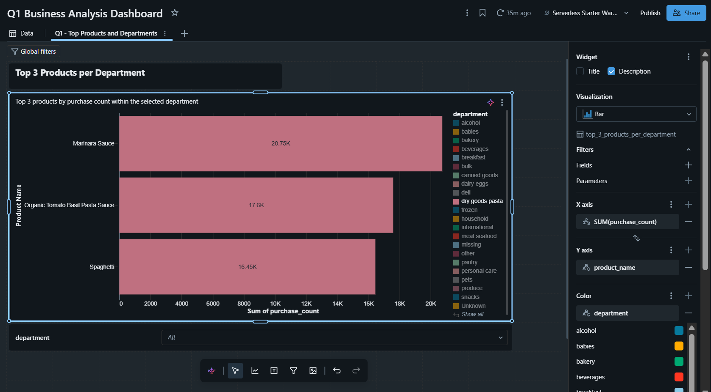

=============================================================================
# 📓 Journal - 2026-09-03 - Day 5: Building Our Q1 Visualizations and Testing Them
=============================================================================

## 📝 A. Today in one sentence
- Reviewed Sara's validation queries, fixed a schema mix-up on my own PR, untangled a branch/main sync confusion, and started building the Q1 dashboard with a working department filter.

## 💡 B. What I learned
- Repeated subqueries can be avoided by using a CTE to calculate each count once.
- How to drop a schema safely using DROP ... CASCADE to remove it along with everything inside it.
- Pushing to a branch tied to an already-merged PR doesn't update main — main only gets updated through a new PR or a fresh merge.

## 📚 C. Terms I am still learning
- **DROP**: deletes a schema, table, or other database object.
- **CASCADE**: used with DROP to also delete everything inside it (e.g., all tables in a schema), instead of erroring if it's not empty.

## 🤔 D. What confused me
- Created my table under a schema (04-business-analysis) that didn't actually exist (the correct one was already there as 04-analytics).

## 🎯 E. One small next step
- [x] Reviewed Sara's Mart data quality validation query (PR #20)
- [x] Reviewed Sara's orders_clean and products_clean validation queries, gave CTE feedback
- [x] Updated my own PR #12, turned the query into a table, per Sara's suggestion
- [x] Fixed a schema mistake (used a schema that didn't exist, switched to the correct one)
- [x] Traced a confusing sync issue back to Sara's folder rename on main, created a fresh branch off main to continue cleanly
- [ ] Started the Q1 dashboard (ongoing)
- [ ] Carried over: Start my Git/GitHub dictionary

## ✅ F. Git checkpoint
- [x] I created or updated a file
- [x] I wrote a commit
- [x] I pushed my changes
- [ ] Built and tested the first Q1 dashboard visualizations (top 3 products per department, with a working department filter)

## 🧭 G. Decisions or assumptions
- Still deciding on the final shape of the Q1 dashboard (which charts to keep, whether to use % share alongside raw counts).

## 📸 H. Evidence from today
1. Reviewed and gave feedback on Sara's PR #21 (row count validation)
2. Fixed my schema mistake and committed the corrected query
3. Tested the department filter on the Q1 dashboard

| Description | Screenshot |
|---|---|
| Reviewed and gave feedback on Sara's PR #21 |  |
| Fixed the schema reference and committed the corrected top-products-per-department query |  |
| Tested the department filter on the Q1 dashboard |  |

|---|---|
| Reviewed and gave feedback on Sara's PR #21 — suggested splitting status into raw_to_clean_status and clean_to_mart_status | Issue #2 comment on line R18 |
| Fixed the schema reference and committed the corrected top-products-per-department query | Git panel diff — old query replaced with updated table version |
| Tested the department filter on the Q1 dashboard | Bar chart filtered to "dry goods pasta" showing top 3 products with labels |

## 🪞 I. Reflection
- What felt easy today: Nothing, really — I was careful to give feedback that would genuinely help, but everything today felt like a learning curve. Still getting lost between Workspace, Catalog, Shared, Git folders, and GitHub with all its PRs. But I know all of it is practice.
- What felt difficult today: Navigating between all these spaces without losing track of where I actually was.
- What I want to understand better next time: Sara mentioned before logging off--if our data were in the millions, we should build the clean layer using `CREATE TABLE IF NOT EXISTS` + `INSERT INTO` instead of `CREATE OR REPLACE TABLE`. Want to research why that pattern is better at scale.

## 💛 J. Pat on my own shoulder :3

=============================================================================
💛I kept showing up even when the tools kept confusing me... that counts for something... right? T.T
=============================================================================

